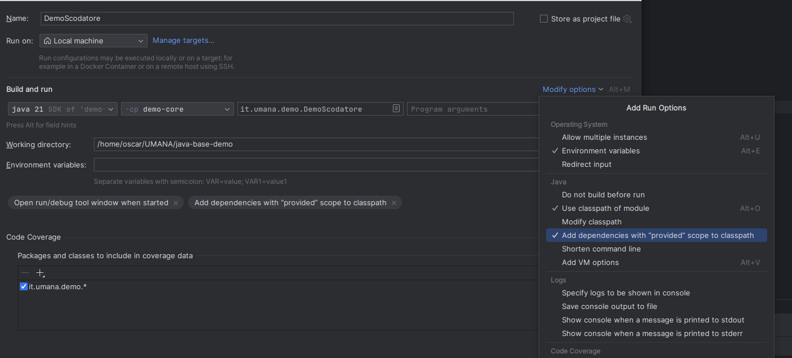

# Demo sui DTO/LOMBOK/RECORD
Comparazioni dei metodi per scrivere una classe DTO
* [PojoDTO.java](demo-core%2Fsrc%2Fmain%2Fjava%2Fit%2Fumana%2Fdemo%2Fdto%2FPojoDTO.java)
* [LombokDTO.java](demo-core%2Fsrc%2Fmain%2Fjava%2Fit%2Fumana%2Fdemo%2Fdto%2FLombokDTO.java)
* [RecordDTO.java](demo-core%2Fsrc%2Fmain%2Fjava%2Fit%2Fumana%2Fdemo%2Fdto%2FRecordDTO.java)

# Demo Mapstruct 
* Vediamo la demo di MapStruct proposta sul sito [mapstruct.org](https://mapstruct.org/).
* Evidenziamo i passaggi necessari per la collaborazione con lombok.

# Demo Scodatore Generalizzato

Mettiamo in pratica un po' della teoria vista.

Per caricare i plugin correttamente impostare IntelliJ per aggiungere le dipendenze di tipo ***provided***

# Esercizio su Scodatore Generalizzato
Creare un plugin che implementi l'interfaccia [IDemoPlugin.java](demo-spi%2Fsrc%2Fmain%2Fjava%2Fit%2Fumana%2Fdemo%2Fspi%2FIDemoPlugin.java)
e che possa stampare a video tutti i dettagli del ___[messaggio di variazione delega](#messaggio-di-variazione-delega)___ descritto in seguito.

L'esercizio dovrà prevedere:

1. La creazione di un nuovo progetto maven con nome plugin-deleghe che conterrà il nuovo plugin.
2. La creazione dei DTO necessari per rappresentare il ___[messaggio di variazione delega](#messaggio-di-variazione-delega)___.
3. La creazione di un'annotazione per gestire le liste di elementi ripetuti.
4. La modifica dei metodi di serializzazione e deserializzazione per gestire la nuova annotazione.
5. La scrittura di un @Test per verificare la corretta serializzazione/deserializzazione. 

## Messaggio di variazione delega

Per ogni evento di inserimento, aggiornamento e cancellazione di una delega viene generato un messaggio 
che prevede una parte fissa di testata seguita da una serie di segmenti opzionali che possono essere o meno presenti. 
Nel caso in cui un segmento sia presente, esso sarà indicato da un apposito TAG seguito dal numero di occorrenze 
di cui è composto.

### Testata
La testata è sempre presente, non possono esistere messaggi sprovvisti di questa sezione.

| Campo              | Descrizione                        |    Form.     | Dim. | Note                                                                                                                            |
|--------------------|------------------------------------|--------------|------|---------------------------------------------------------------------------------------------------------------------------------|
| Funzione           | Tipo funzione richiesta            | Alfanumerico |    3 | Tipo funzione: UPD: Aggiornamento di una delega DEL: Eliminazione di una delega INS: Inserimento di una delega  |
| Istituto           | Codice istituto                    | Numerico     |    5 |                                                                                                                                 |
| Numero delega      | Numero identificativo della delega | Numerico     |   10 |                                                                                                                                 |
| Tipo legame        | Tipo legame                        | Numerico     |    4 |                                                                                                                                 |
| Descrizione legame | Descrizione del tipo legame        | Alfanumerico |   50 |                                                                                                                                 |
| Tipo firma         | Tipo firma                         | Numerico     |    4 |                                                                                                                                 |
| Descrizione firma  | Descrizione tipo firma             | Alfanumerico |   50 |                                                                                                                                 |
| Data inizio        | Data inizio validità della delega  | Data         |    - |                                                                                                                                 |
| Data fine          | Data fine validità della delega    | Data         |    - |                                                                                                                                 |
| Servizio           | Codice servizio del rapporto       | Numerico     |    3 |                                                                                                                                 |
| Categoria          | Codice categoria del rapporto      | Numerico     |    3 |                                                                                                                                 |
| Filiale            | Codice filiale del rapporto        | Numerico     |    5 |                                                                                                                                 |
| Numero             | Numero del rapporto                | Numerico     |    6 |                                                                                                                                 |
| Sottonumero        | Sottonumero del rapporto           | Numerico     |    3 |                                                                                                                                 |

### Segmenti opzionali
Dopo la testata potranno essere presenti alcuni segmenti la cui presenza è opzionale.
Ciascun segmento sarà caratterizzato da un TAG che lo identifica seguito da un numero che indica il numero
delle occorrenze che seguono. 
Nel caso in cui il segmento sia costituito da zero occorrenze non verrà nemmeno riportato il TAG.
Ciascun segmento è chiuso dal TAG del segmento successivo o dalla coda del messaggio.

#### Segmento clienti:

|   Campo    |       Descrizione       |    Form.     | Dim. | I/O | F/O | Note                                                                                                                                                                     |
|------------|-------------------------|--------------|------|-----|-----|--------------------------------------------------------------------------------------------------------------------------------------------------------------------------|
| TAG        | Identificatore segmento | Alfanumerico |    8 |   - |   - | CLIENTI                                                                                                                                                                  |
| Occorrenze | Numero occorrenze       | Numerico     |    3 |   - |   - |                                                                                                                                                                          |
| CDG        | Codice cliente          | Alfanumerico |   13 |   - |   - | Questo campo sarà presente tante volte a seconda del valore del campo precedente. Il dato riporta gli zeri a sinistra per raggiungere la dimensione di 13 caratteri. |

#### Segmento azioni:

|     Campo      |               Descrizione                |    Form.     | Dim. | I/O | F/O |                                Note                                 |
|----------------|------------------------------------------|--------------|------|-----|-----|---------------------------------------------------------------------|
| TAG            | Identificatore segmento                  | Alfanumerico |    8 |   - |   - | AZIONI                                                              |
| Occorrenze     | Numero occorrenze                        | Numerico     |    3 |   - |   - |                                                                     |
| Azioni         | Gruppo                                   |              |      |     |     | Il blocco è ripetuto tante volte come indicato al campo precedente. |
| Tipo azione    | Codice del tipo azione concessa          | Numerico     |    4 |   - |   - | Almeno una occorrenza è obbligatoria                                |
| Descrizione az | Descrizione dell’azione concessa         | Alfanumerico |   50 |   - |   - |                                                                     |
| Minimo         | Soglia minima a cui si applica l’azione  | Numerico     | 13,2 |   - |   - |                                                                     |
| Massimo        | Soglia massima a cui si applica l’azione | Numerico     | 13,2 |   - |   - |                                                                     |

### Coda del messaggio

La coda del messaggio è sempre costituita da un tag così composto: @@@@@@@@.